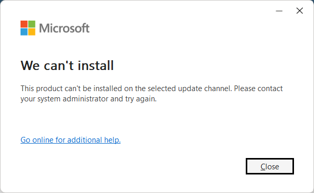

# Office 365 Cleanup PowerShell

PowerShell automation for cleaning and troubleshooting Microsoft 365 / Microsoft Office installations on Windows.

---

## 📌 Problem

This project was created after encountering the following error while attempting to install Microsoft 365:

> **We can't install**
>
> This product can't be installed on the selected update channel. Please contact your system administrator and try again.



The error indicated a possible conflict involving an existing Office installation, Click-to-Run components, services, registry configurations, or Office policies.

Instead of repeatedly attempting the installation manually, the troubleshooting process was transformed into a PowerShell automation workflow.

---

## 🎯 Objective

The main objective of this project is to automate the cleanup of Microsoft 365 / Microsoft Office components from a Windows environment before performing a new installation.

The script is designed to help remove residual components from previous Office installations and configurations that may interfere with a new installation.

---

## ⚙️ What the Script Does

The script performs the following operations:

### 1. Administrative Privilege Verification

The script verifies that PowerShell is running with administrator privileges before continuing.

### 2. Office Application Shutdown

The script identifies and closes running Office-related processes, including:

- Microsoft Word
- Microsoft Excel
- Microsoft PowerPoint
- Microsoft Outlook
- Microsoft OneNote
- Microsoft Access
- Microsoft Publisher
- Microsoft Visio
- Microsoft Project
- Microsoft Lync
- Microsoft Teams
- Office Click-to-Run

### 3. Office Service Shutdown

The script attempts to stop services associated with Microsoft Office, including:

- `ClickToRunSvc`
- `OfficeSvc`
- `osppsvc`

### 4. Click-to-Run Detection and Removal

The script checks the Microsoft Office Click-to-Run configuration and attempts to identify installed products.

When detected, the script uses the Click-to-Run executable to remove the identified Office products.

### 5. Legacy MSI Installation Detection

The script searches Windows uninstall registry locations for previous installations of:

- Microsoft 365
- Microsoft Office
- Office 365
- Microsoft Visio
- Microsoft Project

Detected MSI installations are processed for removal.

### 6. Scheduled Task Cleanup

The script searches for Windows Scheduled Tasks associated with Office and removes them.

### 7. Click-to-Run Service Removal

The script attempts to remove the `ClickToRunSvc` service when it is still present after the previous cleanup operations.

### 8. Residual File Cleanup

The script searches for and removes Office-related directories from locations such as:

- `Program Files`
- `Program Files (x86)`
- `ProgramData`
- `AppData`
- Microsoft Shared Click-to-Run directories

### 9. Registry Backup

Before removing Office policies, the script creates a backup directory on the user's Desktop:

```text
Office_Cleanup_Backup
```

The script exports relevant Office registry keys to `.reg` files before performing policy cleanup.

### 10. Office Policy Cleanup

The script removes Office-related policy registry paths that may contain residual configuration.

### 11. Click-to-Run Registry Cleanup

The script removes remaining Click-to-Run registry configurations.

### 12. Temporary File Cleanup

The script removes Office-related temporary files.

### 13. Final Verification

The script performs a final check for remaining:

- Click-to-Run registry configuration
- Click-to-Run files
- `ClickToRunSvc` service

The result is displayed in the PowerShell console.

---

## 🚀 Usage

### Requirements

- Windows
- PowerShell
- Administrator privileges
- Microsoft Office / Microsoft 365 installation or residual components

### Step 1 — Open PowerShell as Administrator

Open PowerShell using **Run as Administrator**.

### Step 2 — Clone the Repository

```powershell
git clone https://github.com/marcovanbrain/office365-cleanup-powershell.git
```

Enter the project directory:

```powershell
cd office365-cleanup-powershell
```

### Step 3 — Allow Script Execution for the Current Session

If PowerShell prevents the script from starting because of the execution policy, run:

```powershell
Set-ExecutionPolicy -Scope Process -ExecutionPolicy Bypass -Force
```

This changes the execution policy only for the current PowerShell session.

It does **not** permanently modify the Windows execution policy.

> **Note:** The script already contains this configuration internally. The command above is only necessary if PowerShell blocks the script before it can start.

### Step 4 — Unblock the Downloaded Script

If Windows has marked the downloaded file as coming from the Internet:

```powershell
Unblock-File .\Remove-Office365.ps1
```

### Step 5 — Execute the Script

```powershell
.\Remove-Office365.ps1
```

The script requires administrator privileges because it modifies Windows services, scheduled tasks, registry configurations and Office installation components.

---

## ⚠️ Important Warning

This script performs administrative operations and modifies Windows system configuration.

It can remove Microsoft Office components, services, scheduled tasks, files, registry configurations and Office policies.

**Review the script before executing it.**

Before running:

- Save important documents.
- Close Microsoft Office applications.
- Make sure you actually want to remove Office.
- Review the registry operations.
- Ensure you have appropriate administrative permissions.

---

## 🏢 Corporate Environments

Do not execute this script on corporate-managed computers without authorization.

Organizations may manage Microsoft Office through:

- Active Directory
- Group Policy
- Microsoft Intune
- Microsoft Configuration Manager
- Microsoft 365 administration policies
- Enterprise software deployment systems

Removing locally configured Office policies may conflict with organizational management.

---

## 🔐 Registry Backup

Before removing Office policies, the script creates a backup directory on the user's Desktop:

```text
Office_Cleanup_Backup
```

The backup contains exported registry files for relevant Office configuration paths.

This provides a recovery reference before policy cleanup is performed.

---

## 🧠 From Problem to Automation

This project originated from a real troubleshooting scenario.

Instead of treating the installation error as an isolated problem, the troubleshooting process was decomposed into several technical areas:

```text
Installation Error
       │
       ▼
Existing Office Components
       │
       ├── Click-to-Run
       ├── MSI Components
       ├── Services
       ├── Scheduled Tasks
       ├── Registry
       ├── Policies
       └── Temporary Files
              │
              ▼
       Automated Cleanup
              │
              ▼
       Environment Ready
              │
              ▼
       Microsoft 365 Installation
```

The objective is not simply to automate a sequence of commands.

The objective is to transform troubleshooting knowledge into a **reproducible and documented automation workflow**.

---

## 🛠️ Technologies

- PowerShell
- Windows
- Microsoft 365
- Microsoft Office
- Office Click-to-Run
- Windows Registry
- Windows Services
- Windows Scheduled Tasks

---

## 📁 Project Structure

```text
office365-cleanup-powershell/
│
├── Remove-Office365.ps1
├── README.md
├── LICENSE
│
└── docs/
    └── images/
        └── office-installation-error.png
```

---

## 📸 Error Reference

The following screenshot shows the original Microsoft 365 installation error that motivated this project:


---

## 🔄 Workflow

```text
Start
  │
  ▼
Check Administrator Privileges
  │
  ▼
Close Office Applications
  │
  ▼
Stop Office Services
  │
  ▼
Detect Click-to-Run
  │
  ▼
Remove Office Products
  │
  ▼
Detect Legacy MSI Installations
  │
  ▼
Remove Office Scheduled Tasks
  │
  ▼
Remove Click-to-Run Service
  │
  ▼
Backup Registry
  │
  ▼
Remove Office Policies
  │
  ▼
Remove Click-to-Run Registry
  │
  ▼
Clean Residual Files
  │
  ▼
Clean Temporary Files
  │
  ▼
Final Verification
  │
  ▼
Restart Windows
```

---

## 📋 Limitations

This project is intended as a troubleshooting and automation utility.

It does not guarantee that every Microsoft 365 installation problem will be resolved.

The behavior may vary depending on:

- Windows version
- Office version
- Installation type
- User permissions
- Enterprise policies
- Group Policy
- Microsoft Intune configuration
- Existing Office components
- System configuration

---

## ℹ️ Project Status

This is an independent community project created for troubleshooting and automation purposes.

It is not affiliated with or endorsed by Microsoft.

The script should be reviewed and tested in a controlled environment before being used on production or corporate systems.

---

## 🤝 Contributions

Suggestions, improvements, bug reports and pull requests are welcome.

If you find an issue or have an improvement for the cleanup process, feel free to open an issue or submit a pull request.

---

## 📄 License

This project is licensed under the MIT License.

See the [LICENSE](LICENSE) file for details.

---

## 👤 Author

**Marco Pretão**

AI Engineer | Python Developer | Applied AI & Automation | Data Engineering | DevOps | AWS Cloud

GitHub: [@marcovanbrain](https://github.com/marcovanbrain)
